Open Source replacement for MainUI on Miyoo and Trim Devices
and potentially others in the future

### Features
- Faster interface than stock Miyoo
- Full compatability with stock Miyoo apps/emulators
- Improved themeing support 
- PM Support

| Device | Added | Status |
| -- | -- | -- |
| Miyoo Flip -- FW 20250509213001 | Initial | Work in progress |

### Discord
https://discord.gg/Z7AEPNAE9n

### Installation
1) Setup a microSD card with the Stock OS (Can be downloaded here https://github.com/spruceUI/spruceOS/releases/flip0.0)
2) Download the most recent build https://github.com/chrisj951/PyUI/releases
3) Unzip the recent build on top of the sdcard with the stock setup, overwriting all files

NOTE: This uses the same install method as MinUI. There is a way to run it without flashing anything 
which I will make available if enough people are interested in that

### Sample Images
## Stock Look
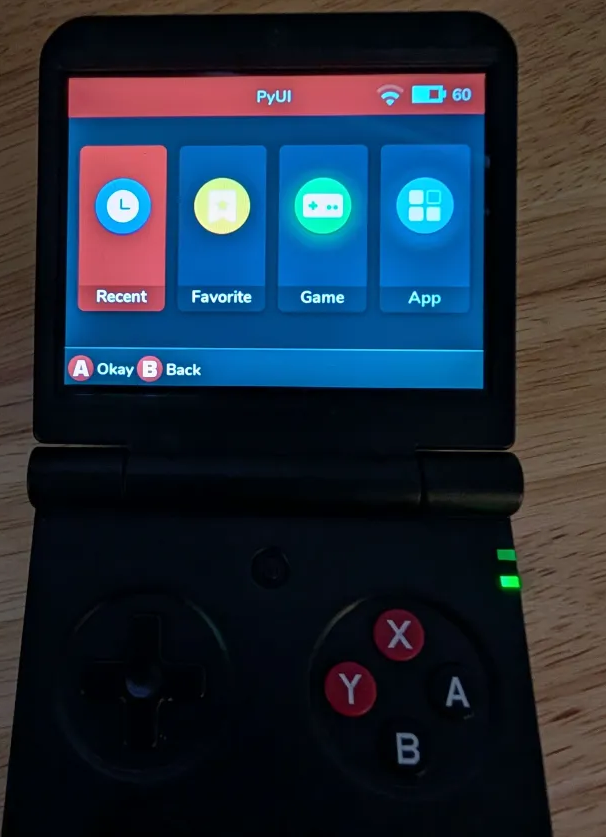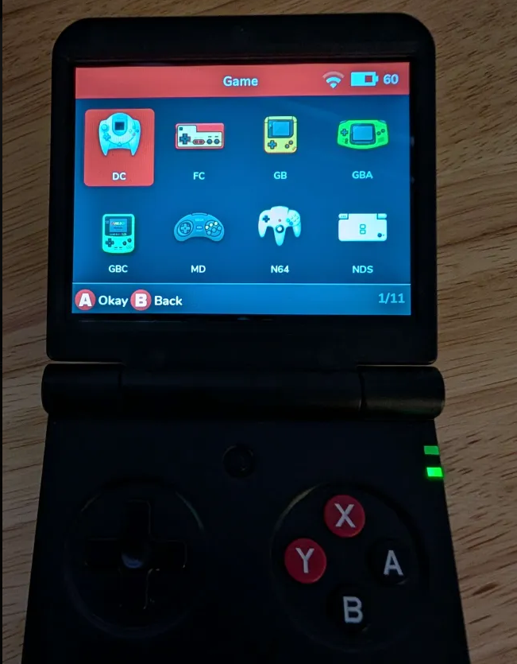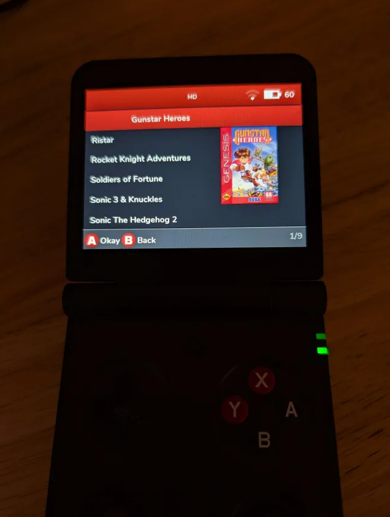

## Stock Grid Layout
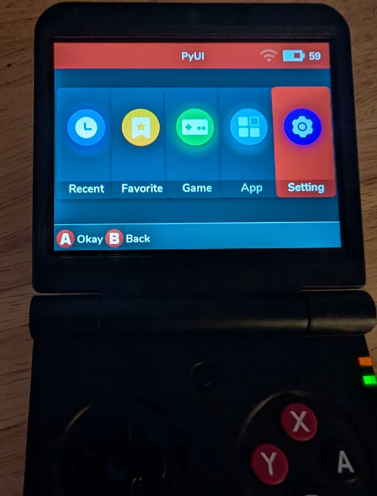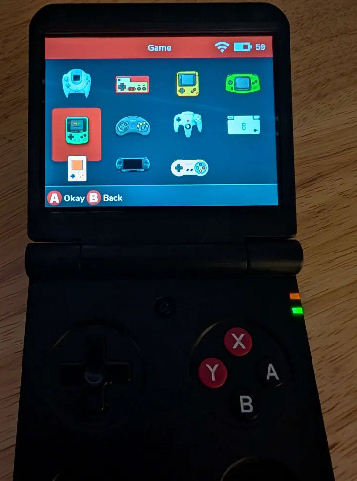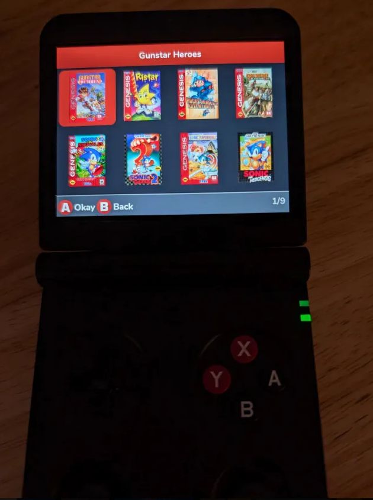

## Minimal
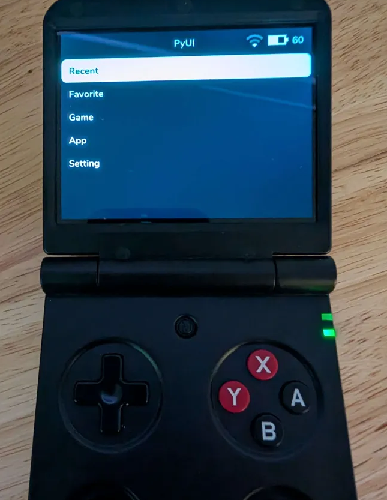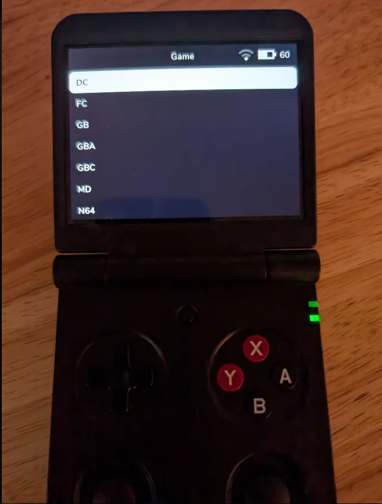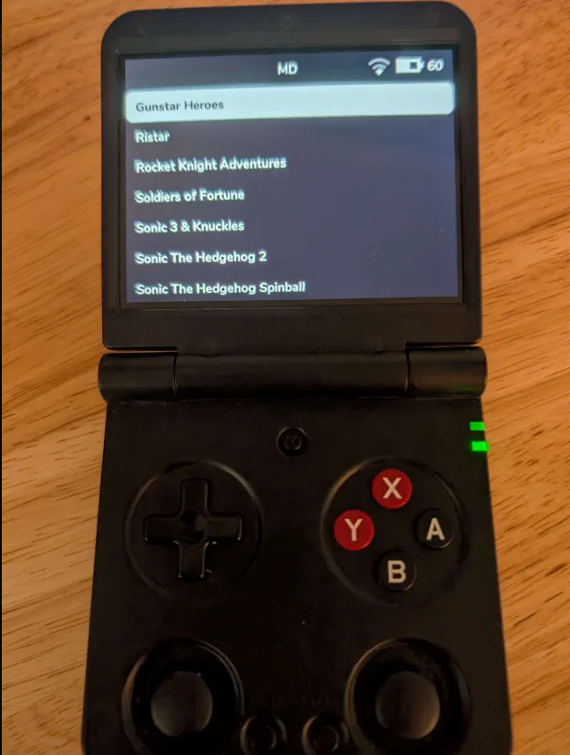

## Epic Artbook Noir (credit to Jamesinorbit for the images)
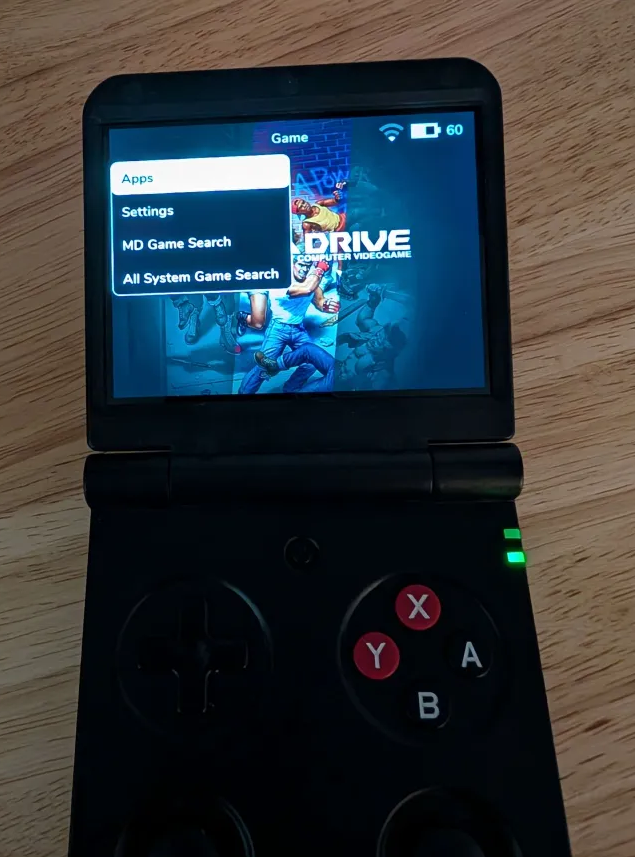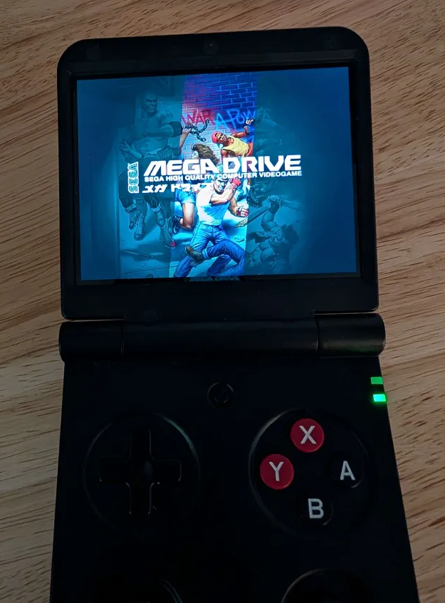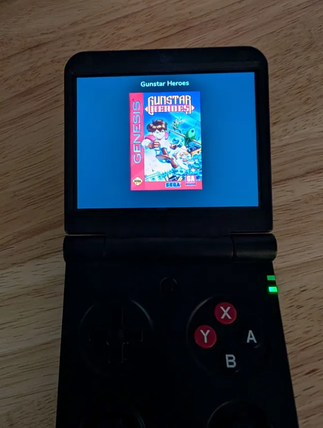

## Thanks
- Spruce team w/ special thanks to
   -  Ry - Ryan Sartor 
   -  SundownerSport
   -  Testers from the Spruce Discord and 
      -  Special thanks to KuroZero for their testing and detailed reports
- Shaun Inman - Development on MinUI making it easier to learn how to interact with the hardware
- Rest of the community that has helped document how these handhelds work
